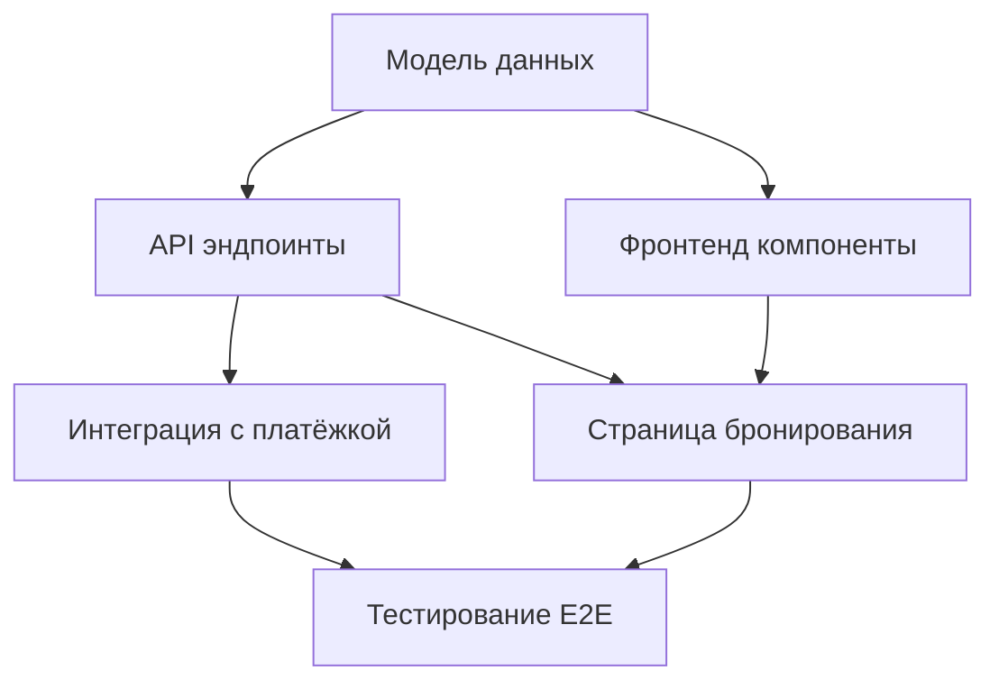

# /new-epic

Разбей большую задачу или эпик на независимые подзадачи, каждая из которых может быть выполнена отдельной сессией Claude Code

## Ограничения

- Read-only для кодовой базы
- Результаты сохраняются в `.context/epics/{дата}/{имя_эпика}/`

## Вход

Пользователь предоставляет описание большой задачи, эпика или ссылку на файл требований из `.context/requirements/`. Если не предоставлено — запроси через AskUserQuestion.

## Фаза 1: Понимание масштаба

Запусти explore-субагента (thoroughness: quick):
- Определить, какие части кодовой базы затронуты
- Найти границы между компонентами (frontend/backend/infra, модули, сервисы)
- Оценить, какие части независимы друг от друга

## Фаза 2: Выделение подзадач

Для каждой подзадачи определи:
- Название — конкретное действие, не абстракция
- Область — какие файлы/модули затрагивает
- Входные зависимости — какие подзадачи должны быть выполнены раньше
- Выходные артефакты — что появится после выполнения (файлы, API, миграции)
- Критерий готовности — как проверить, что подзадача выполнена

Правила декомпозиции:
- Каждая подзадача выполнима за одну сессию (не больше 2-3 часов работы агента)
- Каждая подзадача тестируема отдельно — после выполнения можно проверить, что она работает, не дожидаясь остальных
- Минимум зависимостей между задачами — если две задачи можно выполнить параллельно, они не должны зависеть друг от друга
- Модель данных и миграции — всегда отдельная задача, выполняется первой
- Не декомпозировать слишком мелко — «добавить поле в форму» не заслуживает отдельной задачи, если форма целиком — одна задача

## Фаза 3: Граф зависимостей

Построй граф зависимостей в Mermaid:



Определи:
- Критический путь — самая длинная цепочка зависимостей
- Параллельные ветки — что можно делать одновременно
- Порядок выполнения — нумерация волнами (волна 1: задачи без зависимостей, волна 2: зависят от волны 1, и т.д.)

## Фаза 4: Оформление

Для каждой подзадачи создай файл `.context/epics/{дата}/{имя_эпика}/task_{номер}_{имя}.md`:

```markdown
# Задача: {название}

**Волна:** {номер волны}
**Зависит от:** {список задач или "нет"}
**Область:** {backend/frontend/infra/fullstack}

## Описание
{Что нужно сделать — 2-3 предложения}

## Затрагиваемые файлы/модули
{Список или области кодовой базы}

## Входные артефакты
{Что должно существовать до начала — миграции, API, компоненты}

## Выходные артефакты
{Что появится после выполнения}

## Критерий готовности
{Конкретная проверка: команда, тест, ожидаемый результат}
```

Создай сводный файл `.context/epics/{дата}/{имя_эпика}/README.md`:

```markdown
# Эпик: {название}

## Задачи

| # | Задача | Волна | Зависит от | Область |
|---|--------|-------|------------|---------|
| 1 | ... | 1 | — | backend |
| 2 | ... | 1 | — | frontend |
| 3 | ... | 2 | 1 | backend |

## Граф зависимостей
{Mermaid-диаграмма}

## Критический путь
{Перечисление задач на критическом пути}

## Оценка
- Всего задач: {N}
- Волн: {M}
- Параллельно на первой волне: {K}
```

## Фаза 5: Верификация с пользователем

Покажи:
- Сводную таблицу задач
- Граф зависимостей
- Критический путь

Спроси через AskUserQuestion:
- Правильно ли определены границы задач
- Не пропущено ли что-то
- Устраивает ли порядок и приоритеты

После одобрения — каждая задача готова как вход для уточнения и реализации в ходе одного сеанса claude code.