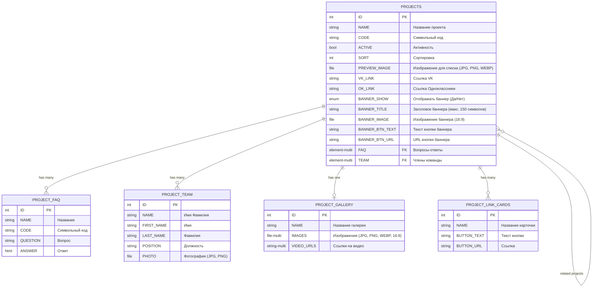

# Паттерны полей из ТЗ и примеры

## Содержание
1. [Паттерны преобразования ТЗ в поля](#паттерны-преобразования-тз-в-поля)
2. [Примеры переиспользования инфоблоков](#примеры-переиспользования-инфоблоков)
3. [Универсальные переиспользуемые инфоблоки](#универсальные-переиспользуемые-инфоблоки)
4. [Пример Mermaid ER-диаграммы](#пример-mermaid-er-диаграммы)
5. [Пример текстового описания](#пример-текстового-описания)
6. [Распространённые ошибки](#распространённые-ошибки)

---

## Паттерны преобразования ТЗ в поля

### Секции с управлением видимостью
```
ТЗ: "Блок можно скрыть в админке"
→ Поле: SECTION_NAME_SHOW, type: 'L', values: ['Да', 'Нет']
```

### Секции с заголовком
```
ТЗ: "Заголовок редактируется в админке"
→ Поле: SECTION_NAME_TITLE, type: 'S'
```

### Карточки с фиксированным количеством
```
ТЗ: "Три карточки, каждая с заголовком и описанием (редактируются в админке)"
→ Поля в основном инфоблоке:
   - CARD_1_TITLE, type: 'S'
   - CARD_1_TEXT, type: 'S', user_type: 'HTML'
   - CARD_2_TITLE, type: 'S'
   - CARD_2_TEXT, type: 'S', user_type: 'HTML'
   - CARD_3_TITLE, type: 'S'
   - CARD_3_TEXT, type: 'S', user_type: 'HTML'
```

### Карточки с неограниченным количеством
```
ТЗ: "Карточки, количество не ограничено, управляются в админке"
→ Создать отдельный инфоблок "Карточки X"
→ Привязка: CARDS_X, type: 'E', multiple: true, link_iblock_id: 'cards_x'
```

### Галереи медиа
```
ТЗ: "До 4 медиа-элементов (фото/видео), порядок задается в админке"
→ Вариант 1 (немного элементов): Поля в основном инфоблоке
   - IMAGES, type: 'F', multiple: true
   - VIDEO_URLS, type: 'S', multiple: true
→ Вариант 2 (для переиспользования): Отдельный инфоблок "Галерея"
   - Привязка: GALLERY, type: 'E', link_iblock_id: 'project_gallery'
```

### Ссылки на соцсети
```
ТЗ: "Иконки соцсетей (VK, ОК), ссылки редактируются в админке, если ссылки нет — иконка не выводится"
→ Поля:
   - VK_LINK, type: 'S'
   - OK_LINK, type: 'S'
(Логика скрытия реализуется в шаблоне, не в инфоблоке)
```

### Кнопки с действиями
```
ТЗ: "Кнопка 'Перейти', текст и URL редактируются в админке"
→ Поля:
   - BUTTON_TEXT, type: 'S'
   - BUTTON_URL, type: 'S'
```

### Аккордеоны/FAQ
```
ТЗ: "Список вопросов-ответов, управляются в админке"
→ Отдельный инфоблок "FAQ"
   - QUESTION, type: 'S'
   - ANSWER, type: 'S', user_type: 'HTML'
→ Привязка: FAQ, type: 'E', multiple: true, link_iblock_id: 'faq'
```

---

## Примеры переиспользования инфоблоков

### Полное совпадение
```
ТЗ требует: "Вопросы-ответы, управляются в админке"
Существует: project_faq (QUESTION, ANSWER)
Решение: Использовать project_faq, создавать новый НЕ нужно
```

### Частичное совпадение
```
ТЗ требует: "Карточки команды: имя, фамилия, должность, фото, email"
Существует: project_team (FIRST_NAME, LAST_NAME, POSITION, PHOTO)
Решение: Добавить поле EMAIL к project_team, создавать новый НЕ нужно
```

### Несовместимость
```
ТЗ требует: "Карточки достижений: название, описание, дата, категория"
Существует: project_team (FIRST_NAME, LAST_NAME, POSITION, PHOTO)
Решение: Создать новый инфоблок project_achievements
```

### Семантическая несовместимость
```
ТЗ требует: "Список преимуществ: заголовок, описание"
Существует: project_faq (QUESTION, ANSWER)
Решение: Создать новый инфоблок project_benefits
  (Хотя структура похожа, семантика разная: преимущества ≠ FAQ)
```

---

## Универсальные переиспользуемые инфоблоки

Эти инфоблоки обычно универсальны и переиспользуются:
- **FAQ** — вопросы-ответы (QUESTION, ANSWER)
- **Team/Команда** — члены команды (FIRST_NAME, LAST_NAME, POSITION, PHOTO)
- **Gallery/Галерея** — медиа-контент (IMAGES, VIDEO_URLS)
- **Reviews/Отзывы** — отзывы пользователей (NAME, TEXT, PHOTO, RATING)
- **Partners/Партнёры** — логотипы партнёров (NAME, LOGO, URL)

---

## Пример Mermaid ER-диаграммы



---

## Пример текстового описания

```
## Анализ существующих инфоблоков

Найдены следующие инфоблоки:
- project_faq (QUESTION, ANSWER)
- project_team (FIRST_NAME, LAST_NAME, POSITION, PHOTO)
- project_gallery (IMAGES, VIDEO_URLS)

## Решения о переиспользовании

1. FAQ: Переиспользуется project_faq (структура полностью соответствует)
2. Команда: Дополняется project_team (добавляется поле EMAIL)
3. Галерея: Переиспользуется project_gallery
4. Карточки достижений: Создаётся achievements (семантически отличается от существующих)

## Описание инфоблоков

### ОСНОВНОЙ ИНФОБЛОК: projects
[полный список полей]

### СВЯЗАННЫЙ ИНФОБЛОК: project_faq (СУЩЕСТВУЮЩИЙ)
Переиспользуется без изменений

### СВЯЗАННЫЙ ИНФОБЛОК: project_team (СУЩЕСТВУЮЩИЙ + НОВОЕ ПОЛЕ)
Добавляется поле:
- EMAIL - Email члена команды, тип: строка

### СВЯЗАННЫЙ ИНФОБЛОК: achievements (НОВЫЙ)
Создаётся новый инфоблок
Поля:
[...]
```

---

## Распространённые ошибки

### Создание полей для статического контента

**Неправильно:**
```
ТЗ: "Навигационные стрелки справа внизу"
→ Создать поле SHOW_ARROWS, type: 'L'
```
Нет явного указания на редактируемость — это статический элемент шаблона.

**Правильно:**
```
ТЗ: "Навигационные стрелки справа внизу"
→ Статический элемент шаблона, поля не требуются.
```

### Создание инфоблока для фиксированных нередактируемых карточек

**Неправильно:**
```
ТЗ: "Три карточки, содержащие заголовок и описание"
→ Создать связанный инфоблок "Карточки"
```
Нет упоминания редактируемости и количество фиксировано.

**Правильно:**
```
ТЗ: "Три карточки, содержащие заголовок и описание"
→ Статический контент, поля не требуются.

ТЗ: "Три карточки, заголовок и описание редактируются в админке"
→ Поля: CARD_1_TITLE, CARD_1_TEXT, CARD_2_TITLE, CARD_2_TEXT, CARD_3_TITLE, CARD_3_TEXT
```

### Попытка задать maxlength на уровне конфигурации

**Неправильно:**
```
ТЗ: "Заголовок (редактируется, максимум 150 символов)"
→ TITLE, type: 'S', maxlength: 150
```
В Bitrix нет параметра maxlength в конфигурации свойства.

**Правильно:**
```
→ TITLE, type: 'S', name: 'Заголовок (макс. 150 символов)'
```

### Игнорирование существующих инфоблоков

**Неправильно:**
```
ТЗ: "Список вопросов-ответов, управляются в админке"
→ Создать новый инфоблок "FAQ для страницы X"
```

**Правильно:**
```
Шаг 1: Проверяем local/config/iblocks/
Шаг 2: Найден project_faq (QUESTION, ANSWER)
Шаг 3: Переиспользуем project_faq
```
